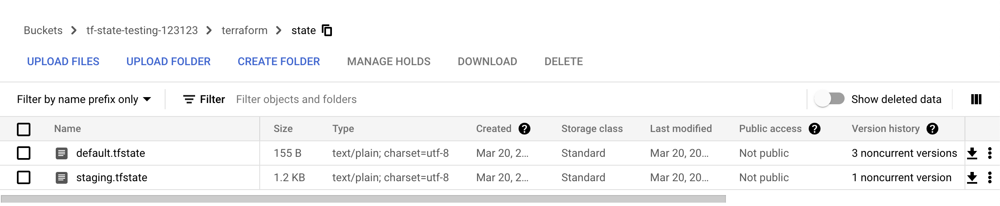

# Workspace
This playbook demonstrate how to manage multiple workspaces using GCS backend.
Each Terraform configuration has an associated [backend](https://www.terraform.io/language/settings/backends) that defines how operations are executed and where persistent data such as [the Terraform state](https://www.terraform.io/language/state/purpose) are stored.  
Certain backends support multiple workspace naming, and allow it to be associated with only one configuration. To learn more, read [this page](https://www.terraform.io/language/state/workspaces).  

Workspaces in Terraform are managed via `$ terraform workspace` command with the following options:
```
$ terraform workspace
Usage: terraform workspace [options]

  new, list, show, select and delete Terraform workspaces.
```

By default Terraform has one workspace named as `default`.

## Step to Execute
1. Execute `$ terraform init`
2. If you wish to see the plan, use `$ terraform plan`
3. Execute `$ terraform apply`
4. To destroy, use `$ terraform destroy`

Note: If you wish not to review the plan, add the `-auto-approve` flag when applying/destroying changes.  

To create a new workspace, use:
```
$ terraform workspace new [workspace_name]
```

To list available workspaces, use:
```
$ terraform workspace list
```

To switch between workspaces, use:
```
$ terraform workspace select [workspace_name]
```

To delete a workspace, use:
```
$ terraform workspace delete [workspace_name]
```

## Explaination
Once you've done applying your Terraform code for each workspace, try to navigate the GCS bucket and you'll see how Terraform stores each workspace state in different files. Below is my example:
